# [📈 Live Status](https://CesarIvanSolis.github.io/Upptime): <!--live status--> **🟧 Partial outage**

This repository contains the open-source uptime monitor and status page for [CesarIvanSolis](https://CesarIvanSolis.github.io/Upptime), powered by [Upptime](https://github.com/upptime/upptime).

With [Upptime](https://upptime.js.org), you can get your own unlimited and free uptime monitor and status page, powered entirely by a GitHub repository. We use [Issues](https://github.com/CesarIvanSolis/Upptime/issues) as incident reports, [Actions](https://github.com/CesarIvanSolis/Upptime/actions) as uptime monitors, and [Pages](https://CesarIvanSolis.github.io/Upptime) for the status page.

<!--start: status pages-->
<!-- This summary is generated by Upptime (https://github.com/upptime/upptime) -->
<!-- Do not edit this manually, your changes will be overwritten -->
<!-- prettier-ignore -->
| URL | Status | History | Response Time | Uptime |
| --- | ------ | ------- | ------------- | ------ |
|  [Google](https://www.google.com) | 🟩 Up | [google.yml](https://github.com/CesarIvanSolis/Upptime/commits/HEAD/history/google.yml) | 

 149ms
     
 | 

<a href="https://CesarIvanSolis.github.io/Upptime/history/google">100.00%</a>
    

|  [ctrlDoctosContra](http://172.20.36.53/ctrlDoctosContra/Publico/Homepage.aspx) | 🟥 Down | [ctrl-doctos-contra.yml](https://github.com/CesarIvanSolis/Upptime/commits/HEAD/history/ctrl-doctos-contra.yml) | 

 0ms
     
 | 

<a href="https://CesarIvanSolis.github.io/Upptime/history/ctrl-doctos-contra">0.00%</a>
    

|  [sisarh2018](http://172.20.6.248/sisarh2018/) | 🟥 Down | [sisarh2018.yml](https://github.com/CesarIvanSolis/Upptime/commits/HEAD/history/sisarh2018.yml) | 

 0ms
     
 | 

<a href="https://CesarIvanSolis.github.io/Upptime/history/sisarh2018">0.00%</a>
    

|  [caan](http://caan.morelia.gob.mx/autenticar) | 🟩 Up | [caan.yml](https://github.com/CesarIvanSolis/Upptime/commits/HEAD/history/caan.yml) | 

 6395ms
     
 | 

<a href="https://CesarIvanSolis.github.io/Upptime/history/caan">100.00%</a>
    

|  [cartoweb](http://cartoweb.morelia.gob.mx) | 🟩 Up | [cartoweb.yml](https://github.com/CesarIvanSolis/Upptime/commits/HEAD/history/cartoweb.yml) | 

 382ms
     
 | 

<a href="https://CesarIvanSolis.github.io/Upptime/history/cartoweb">100.00%</a>
    

|  [catalogooficial](http://catalogooficial.morelia.gob.mx) | 🟩 Up | [catalogooficial.yml](https://github.com/CesarIvanSolis/Upptime/commits/HEAD/history/catalogooficial.yml) | 

 336ms
     
 | 

<a href="https://CesarIvanSolis.github.io/Upptime/history/catalogooficial">100.00%</a>
    

|  [catim](http://catim.morelia.gob.mx/) | 🟥 Down | [catim.yml](https://github.com/CesarIvanSolis/Upptime/commits/HEAD/history/catim.yml) | 

 888ms
     
 | 

<a href="https://CesarIvanSolis.github.io/Upptime/history/catim">0.00%</a>
    

|  [condonaciones](http://condonaciones.morelia.gob.mx/bootstrap/modelos/logs/) | 🟥 Down | [condonaciones.yml](https://github.com/CesarIvanSolis/Upptime/commits/HEAD/history/condonaciones.yml) | 

 0ms
     
 | 

<a href="https://CesarIvanSolis.github.io/Upptime/history/condonaciones">0.00%</a>
    

|  [condonaciones siscaing](http://condonaciones.morelia.gob.mx/loginUserSiscaing.php) | 🟥 Down | [condonaciones-siscaing.yml](https://github.com/CesarIvanSolis/Upptime/commits/HEAD/history/condonaciones-siscaing.yml) | 

 0ms
     
 | 

<a href="https://CesarIvanSolis.github.io/Upptime/history/condonaciones-siscaing">0.00%</a>
    

|  [creditos](http://creditos.morelia.gob.mx/autenticar) | 🟩 Up | [creditos.yml](https://github.com/CesarIvanSolis/Upptime/commits/HEAD/history/creditos.yml) | 

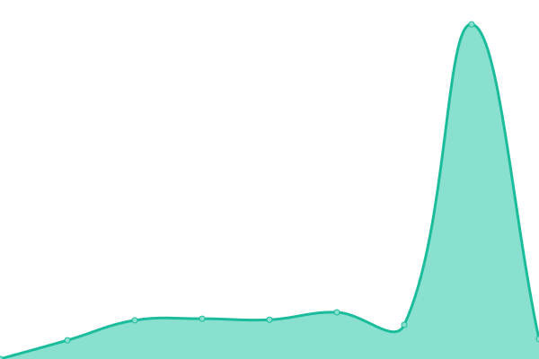 506ms
     
 | 

<a href="https://CesarIvanSolis.github.io/Upptime/history/creditos">100.00%</a>
    

|  [csi](http://csi.morelia.gob.mx/Publico/homepage.aspx) | 🟥 Down | [csi.yml](https://github.com/CesarIvanSolis/Upptime/commits/HEAD/history/csi.yml) | 

 0ms
     
 | 

<a href="https://CesarIvanSolis.github.io/Upptime/history/csi">0.00%</a>
    

|  [geopai](http://geopai.morelia.gob.mx/) | 🟥 Down | [geopai.yml](https://github.com/CesarIvanSolis/Upptime/commits/HEAD/history/geopai.yml) | 

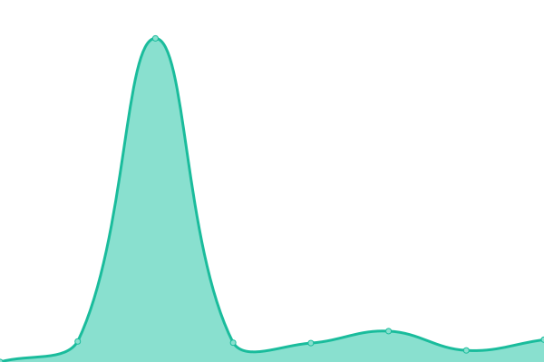 782ms
     
 | 

<a href="https://CesarIvanSolis.github.io/Upptime/history/geopai">0.00%</a>
    

|  [gestion cartografia](http://gestion.cartografia.morelia.gob.mx/) | 🟥 Down | [gestion-cartografia.yml](https://github.com/CesarIvanSolis/Upptime/commits/HEAD/history/gestion-cartografia.yml) | 

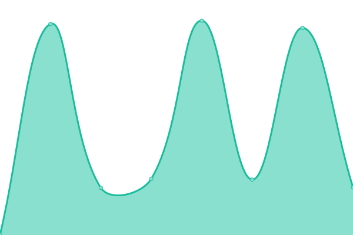 786ms
     
 | 

<a href="https://CesarIvanSolis.github.io/Upptime/history/gestion-cartografia">0.00%</a>
    

|  [git](http://git.morelia.gob.mx/produccion) | 🟩 Up | [git.yml](https://github.com/CesarIvanSolis/Upptime/commits/HEAD/history/git.yml) | 

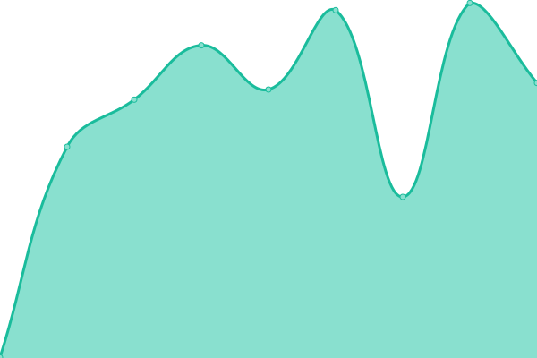 436ms
     
 | 

<a href="https://CesarIvanSolis.github.io/Upptime/history/git">100.00%</a>
    

|  [morelos](http://morelos.morelia.gob.mx/exekaja/IngresosOrdenes/) | 🟩 Up | [morelos.yml](https://github.com/CesarIvanSolis/Upptime/commits/HEAD/history/morelos.yml) | 

 238ms
     
 | 

<a href="https://CesarIvanSolis.github.io/Upptime/history/morelos">100.00%</a>
    

|  [patrimonio](http://patrimonio.morelia.gob.mx/) | 🟩 Up | [patrimonio.yml](https://github.com/CesarIvanSolis/Upptime/commits/HEAD/history/patrimonio.yml) | 

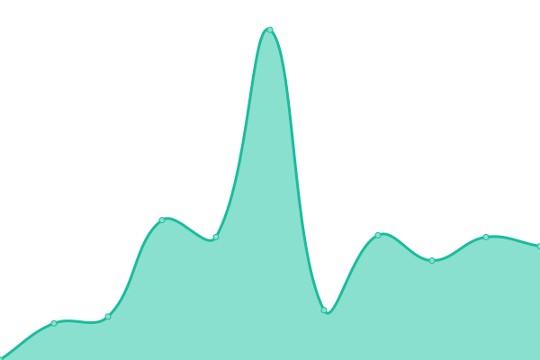 1644ms
     
 | 

<a href="https://CesarIvanSolis.github.io/Upptime/history/patrimonio">100.00%</a>
    

|  [quejanet](http://quejanet.morelia.gob.mx/) | 🟩 Up | [quejanet.yml](https://github.com/CesarIvanSolis/Upptime/commits/HEAD/history/quejanet.yml) | 

 257ms
     
 | 

<a href="https://CesarIvanSolis.github.io/Upptime/history/quejanet">100.00%</a>
    

|  [quejanet acceso](http://quejanet.morelia.gob.mx/ACCESO.ASPX) | 🟩 Up | [quejanet-acceso.yml](https://github.com/CesarIvanSolis/Upptime/commits/HEAD/history/quejanet-acceso.yml) | 

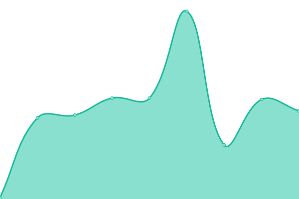 71ms
     
 | 

<a href="https://CesarIvanSolis.github.io/Upptime/history/quejanet-acceso">100.00%</a>
    

|  [scu](http://scu.morelia.gob.mx) | 🟩 Up | [scu.yml](https://github.com/CesarIvanSolis/Upptime/commits/HEAD/history/scu.yml) | 

 542ms
     
 | 

<a href="https://CesarIvanSolis.github.io/Upptime/history/scu">100.00%</a>
    

|  [servicios](https://servicios.morelia.gob.mx/webservice/obtener_token_sesion) | 🟩 Up | [servicios.yml](https://github.com/CesarIvanSolis/Upptime/commits/HEAD/history/servicios.yml) | 

 659ms
     
 | 

<a href="https://CesarIvanSolis.github.io/Upptime/history/servicios">100.00%</a>
    

|  [servicios factura](http://servicios.morelia.gob.mx/Factura33) | 🟥 Down | [servicios-factura.yml](https://github.com/CesarIvanSolis/Upptime/commits/HEAD/history/servicios-factura.yml) | 

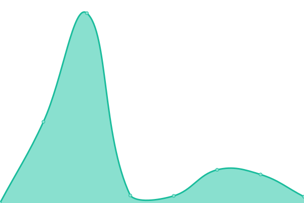 2282ms
     
 | 

<a href="https://CesarIvanSolis.github.io/Upptime/history/servicios-factura">0.00%</a>
    

|  [servicios code](http://servicios.morelia.gob.mx/phpqrcode) | 🟩 Up | [servicios-code.yml](https://github.com/CesarIvanSolis/Upptime/commits/HEAD/history/servicios-code.yml) | 

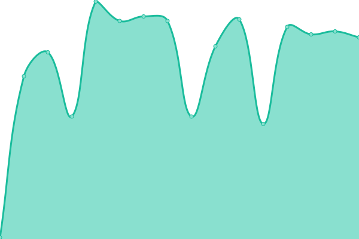 123ms
     
 | 

<a href="https://CesarIvanSolis.github.io/Upptime/history/servicios-code">99.60%</a>
    

|  [sicve](http://sicve.morelia.gob.mx/) | 🟩 Up | [sicve.yml](https://github.com/CesarIvanSolis/Upptime/commits/HEAD/history/sicve.yml) | 

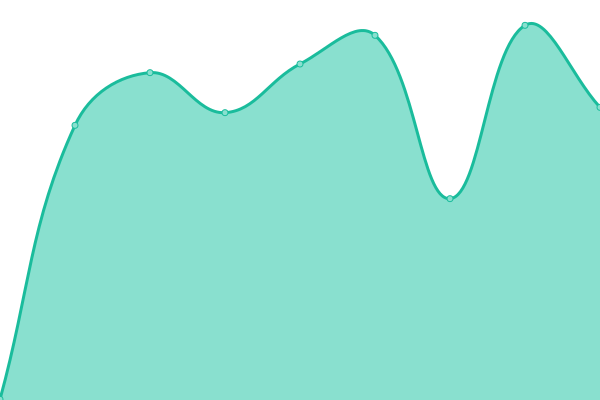 448ms
     
 | 

<a href="https://CesarIvanSolis.github.io/Upptime/history/sicve">100.00%</a>
    

|  [sisac](http://sisac.morelia.gob.mx/sisac) | 🟥 Down | [sisac.yml](https://github.com/CesarIvanSolis/Upptime/commits/HEAD/history/sisac.yml) | 

 0ms
     
 | 

<a href="https://CesarIvanSolis.github.io/Upptime/history/sisac">0.00%</a>
    

|  [sisac contabilidad](http://sisac.morelia.gob.mx/sisam/contabilidad.html) | 🟥 Down | [sisac-contabilidad.yml](https://github.com/CesarIvanSolis/Upptime/commits/HEAD/history/sisac-contabilidad.yml) | 

 0ms
     
 | 

<a href="https://CesarIvanSolis.github.io/Upptime/history/sisac-contabilidad">0.00%</a>
    

|  [sisam recursoshumanos](http://sisac.morelia.gob.mx/sisam/recursoshumanos.html) | 🟥 Down | [sisam-recursoshumanos.yml](https://github.com/CesarIvanSolis/Upptime/commits/HEAD/history/sisam-recursoshumanos.yml) | 

 0ms
     
 | 

<a href="https://CesarIvanSolis.github.io/Upptime/history/sisam-recursoshumanos">0.00%</a>
    

|  [sisam 2018](http://sisam.morelia.gob.mx/SISAM2018) | 🟩 Up | [sisam-2018.yml](https://github.com/CesarIvanSolis/Upptime/commits/HEAD/history/sisam-2018.yml) | 

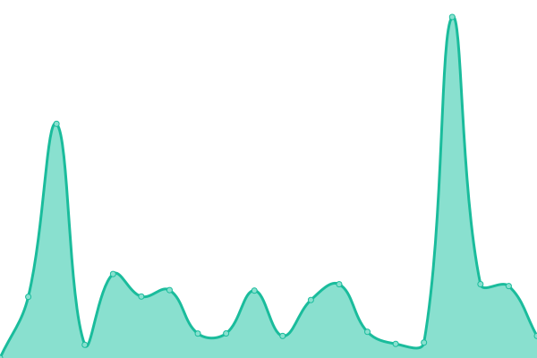 1329ms
     
 | 

<a href="https://CesarIvanSolis.github.io/Upptime/history/sisam-2018">99.14%</a>
    

|  [sisam 2019](http://sisam.morelia.gob.mx/SISAM2019) | 🟩 Up | [sisam-2019.yml](https://github.com/CesarIvanSolis/Upptime/commits/HEAD/history/sisam-2019.yml) | 

 300ms
     
 | 

<a href="https://CesarIvanSolis.github.io/Upptime/history/sisam-2019">99.53%</a>
    

|  [sisam 2020](http://sisam.morelia.gob.mx/SISAM2020) | 🟩 Up | [sisam-2020.yml](https://github.com/CesarIvanSolis/Upptime/commits/HEAD/history/sisam-2020.yml) | 

 302ms
     
 | 

<a href="https://CesarIvanSolis.github.io/Upptime/history/sisam-2020">99.53%</a>
    

|  [sisam 2021](http://sisam.morelia.gob.mx/SISAM2021-SEP-DIC) | 🟩 Up | [sisam-2021.yml](https://github.com/CesarIvanSolis/Upptime/commits/HEAD/history/sisam-2021.yml) | 

 295ms
     
 | 

<a href="https://CesarIvanSolis.github.io/Upptime/history/sisam-2021">99.53%</a>
    

|  [sisam 2022](http://sisam.morelia.gob.mx/SISAM2022) | 🟩 Up | [sisam-2022.yml](https://github.com/CesarIvanSolis/Upptime/commits/HEAD/history/sisam-2022.yml) | 

 296ms
     
 | 

<a href="https://CesarIvanSolis.github.io/Upptime/history/sisam-2022">99.53%</a>
    

|  [sisam 2023](http://sisam.morelia.gob.mx/SISAM2023) | 🟩 Up | [sisam-2023.yml](https://github.com/CesarIvanSolis/Upptime/commits/HEAD/history/sisam-2023.yml) | 

 298ms
     
 | 

<a href="https://CesarIvanSolis.github.io/Upptime/history/sisam-2023">99.53%</a>
    

|  [sisam siop](http://sisam.morelia.gob.mx/SISAM2023/SIOP/CASVI.jsp) | 🟩 Up | [sisam-siop.yml](https://github.com/CesarIvanSolis/Upptime/commits/HEAD/history/sisam-siop.yml) | 

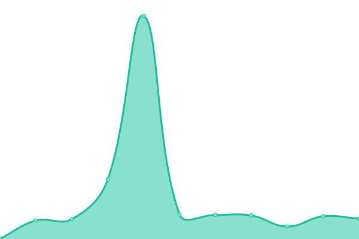 297ms
     
 | 

<a href="https://CesarIvanSolis.github.io/Upptime/history/sisam-siop">99.53%</a>
    

|  [timbrado](http://timbrado.morelia.gob.mx/vistas/login.aspx) | 🟥 Down | [timbrado.yml](https://github.com/CesarIvanSolis/Upptime/commits/HEAD/history/timbrado.yml) | 

 0ms
     
 | 

<a href="https://CesarIvanSolis.github.io/Upptime/history/timbrado">0.00%</a>
    

|  [tramites](http://tramites.morelia.gob.mx/) | 🟥 Down | [tramites.yml](https://github.com/CesarIvanSolis/Upptime/commits/HEAD/history/tramites.yml) | 

 0ms
     
 | 

<a href="https://CesarIvanSolis.github.io/Upptime/history/tramites">0.00%</a>
    

|  [wscaja](http://wscaja.morelia.gob.mx/Logincajanetcontroller/Loadform/?datosjson=1) | 🟩 Up | [wscaja.yml](https://github.com/CesarIvanSolis/Upptime/commits/HEAD/history/wscaja.yml) | 

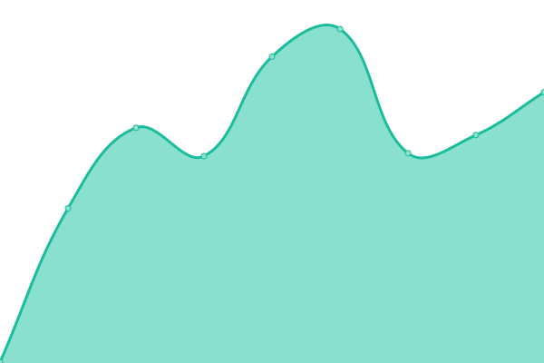 332ms
     
 | 

<a href="https://CesarIvanSolis.github.io/Upptime/history/wscaja">100.00%</a>
    

|  [wsk](http://wsk.morelia.gob.mx/monitoreo/login/index.php) | 🟥 Down | [wsk.yml](https://github.com/CesarIvanSolis/Upptime/commits/HEAD/history/wsk.yml) | 

 0ms
     
 | 

<a href="https://CesarIvanSolis.github.io/Upptime/history/wsk">0.00%</a>
    

|  [kiosco](http://ws-kiosco.morelia.gob.mx/) | 🟥 Down | [kiosco.yml](https://github.com/CesarIvanSolis/Upptime/commits/HEAD/history/kiosco.yml) | 

 0ms
     
 | 

<a href="https://CesarIvanSolis.github.io/Upptime/history/kiosco">0.00%</a>
    

|  [bienesmuebles](https://bienesmuebles.morelia.gob.mx/) | 🟥 Down | [bienesmuebles.yml](https://github.com/CesarIvanSolis/Upptime/commits/HEAD/history/bienesmuebles.yml) | 

 0ms
     
 | 

<a href="https://CesarIvanSolis.github.io/Upptime/history/bienesmuebles">0.00%</a>
    

|  [bolsadetrabajo](https://bolsadetrabajo.morelia.gob.mx/) | 🟩 Up | [bolsadetrabajo.yml](https://github.com/CesarIvanSolis/Upptime/commits/HEAD/history/bolsadetrabajo.yml) | 

 5169ms
     
 | 

<a href="https://CesarIvanSolis.github.io/Upptime/history/bolsadetrabajo">100.00%</a>
    

|  [cabildojuvenil](https://cabildojuvenil.morelia.gob.mx/) | 🟩 Up | [cabildojuvenil.yml](https://github.com/CesarIvanSolis/Upptime/commits/HEAD/history/cabildojuvenil.yml) | 

 360ms
     
 | 

<a href="https://CesarIvanSolis.github.io/Upptime/history/cabildojuvenil">100.00%</a>
    

|  [callescols](https://callescols.morelia.gob.mx/) | 🟩 Up | [callescols.yml](https://github.com/CesarIvanSolis/Upptime/commits/HEAD/history/callescols.yml) | 

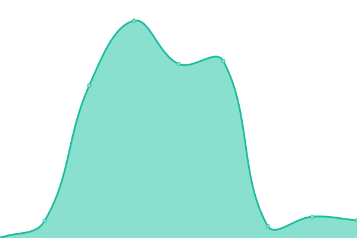 2101ms
     
 | 

<a href="https://CesarIvanSolis.github.io/Upptime/history/callescols">100.00%</a>
    

|  [casvi](https://casvi.morelia.gob.mx/) | 🟩 Up | [casvi.yml](https://github.com/CesarIvanSolis/Upptime/commits/HEAD/history/casvi.yml) | 

 365ms
     
 | 

<a href="https://CesarIvanSolis.github.io/Upptime/history/casvi">100.00%</a>
    

|  [ccpw](https://ccpw.morelia.gob.mx/) | 🟥 Down | [ccpw.yml](https://github.com/CesarIvanSolis/Upptime/commits/HEAD/history/ccpw.yml) | 

 0ms
     
 | 

<a href="https://CesarIvanSolis.github.io/Upptime/history/ccpw">0.00%</a>
    

|  [ciedim](https://ciedim.morelia.gob.mx/) | 🟩 Up | [ciedim.yml](https://github.com/CesarIvanSolis/Upptime/commits/HEAD/history/ciedim.yml) | 

 441ms
     
 | 

<a href="https://CesarIvanSolis.github.io/Upptime/history/ciedim">100.00%</a>
    

|  [consejociudadano](https://consejociudadano.morelia.gob.mx/) | 🟩 Up | [consejociudadano.yml](https://github.com/CesarIvanSolis/Upptime/commits/HEAD/history/consejociudadano.yml) | 

 4027ms
     
 | 

<a href="https://CesarIvanSolis.github.io/Upptime/history/consejociudadano">100.00%</a>
    

|  [contraloria](https://contraloria.morelia.gob.mx/) | 🟩 Up | [contraloria.yml](https://github.com/CesarIvanSolis/Upptime/commits/HEAD/history/contraloria.yml) | 

 3164ms
     
 | 

<a href="https://CesarIvanSolis.github.io/Upptime/history/contraloria">100.00%</a>
    

|  [corralon](https://corralon.morelia.gob.mx/) | 🟩 Up | [corralon.yml](https://github.com/CesarIvanSolis/Upptime/commits/HEAD/history/corralon.yml) | 

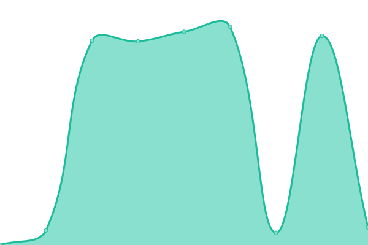 3535ms
     
 | 

<a href="https://CesarIvanSolis.github.io/Upptime/history/corralon">100.00%</a>
    

|  [ctrldoctosobras](https://ctrldoctosobras.morelia.gob.mx/Publico/homepage.aspx) | 🟥 Down | [ctrldoctosobras.yml](https://github.com/CesarIvanSolis/Upptime/commits/HEAD/history/ctrldoctosobras.yml) | 

 0ms
     
 | 

<a href="https://CesarIvanSolis.github.io/Upptime/history/ctrldoctosobras">0.00%</a>
    

|  [declaraciones](https://declaraciones.morelia.gob.mx) | 🟥 Down | [declaraciones.yml](https://github.com/CesarIvanSolis/Upptime/commits/HEAD/history/declaraciones.yml) | 

 610ms
     
 | 

<a href="https://CesarIvanSolis.github.io/Upptime/history/declaraciones">17.65%</a>
    

|  [dro](https://dro.morelia.gob.mx/) | 🟩 Up | [dro.yml](https://github.com/CesarIvanSolis/Upptime/commits/HEAD/history/dro.yml) | 

 377ms
     
 | 

<a href="https://CesarIvanSolis.github.io/Upptime/history/dro">99.75%</a>
    

|  [ofuscador](https://dticws.morelia.gob.mx/ofuscador) | 🟩 Up | [ofuscador.yml](https://github.com/CesarIvanSolis/Upptime/commits/HEAD/history/ofuscador.yml) | 

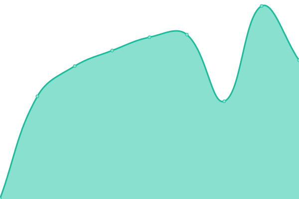 677ms
     
 | 

<a href="https://CesarIvanSolis.github.io/Upptime/history/ofuscador">100.00%</a>
    

|  [progamador tareas](https://dticws.morelia.gob.mx/ProgramadorTareas) | 🟩 Up | [progamador-tareas.yml](https://github.com/CesarIvanSolis/Upptime/commits/HEAD/history/progamador-tareas.yml) | 

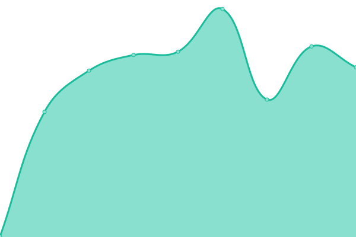 360ms
     
 | 

<a href="https://CesarIvanSolis.github.io/Upptime/history/progamador-tareas">100.00%</a>
    

|  [educacionambiental](https://educacionambiental.morelia.gob.mx/) | 🟩 Up | [educacionambiental.yml](https://github.com/CesarIvanSolis/Upptime/commits/HEAD/history/educacionambiental.yml) | 

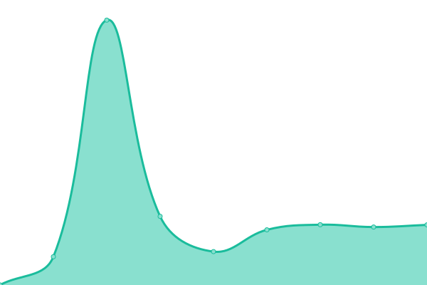 1493ms
     
 | 

<a href="https://CesarIvanSolis.github.io/Upptime/history/educacionambiental">100.00%</a>
    

|  [ciudadanos](https://ciudadanos.morelia.gob.mx) | 🟥 Down | [ciudadanos.yml](https://github.com/CesarIvanSolis/Upptime/commits/HEAD/history/ciudadanos.yml) | 

 0ms
     
 | 

<a href="https://CesarIvanSolis.github.io/Upptime/history/ciudadanos">0.00%</a>
    

|  [gestion 2](https://gestion.morelia.gob.mx/) | 🟩 Up | [gestion-2.yml](https://github.com/CesarIvanSolis/Upptime/commits/HEAD/history/gestion-2.yml) | 

 599ms
     
 | 

<a href="https://CesarIvanSolis.github.io/Upptime/history/gestion-2">100.00%</a>
    

|  [immujeris](https://immujeris.morelia.gob.mx/) | 🟩 Up | [immujeris.yml](https://github.com/CesarIvanSolis/Upptime/commits/HEAD/history/immujeris.yml) | 

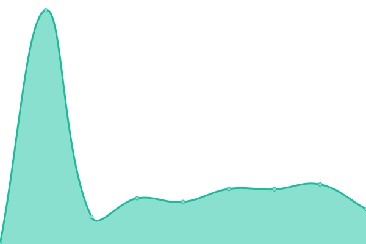 1409ms
     
 | 

<a href="https://CesarIvanSolis.github.io/Upptime/history/immujeris">100.00%</a>
    

|  [internetpublico](https://internetpublico.morelia.gob.mx/) | 🟩 Up | [internetpublico.yml](https://github.com/CesarIvanSolis/Upptime/commits/HEAD/history/internetpublico.yml) | 

 336ms
     
 | 

<a href="https://CesarIvanSolis.github.io/Upptime/history/internetpublico">100.00%</a>
    

|  [licfunweb](https://licfunweb.morelia.gob.mx/) | 🟩 Up | [licfunweb.yml](https://github.com/CesarIvanSolis/Upptime/commits/HEAD/history/licfunweb.yml) | 

 1252ms
     
 | 

<a href="https://CesarIvanSolis.github.io/Upptime/history/licfunweb">99.53%</a>
    

|  [lineadirecta](https://lineadirecta.morelia.gob.mx/) | 🟩 Up | [lineadirecta.yml](https://github.com/CesarIvanSolis/Upptime/commits/HEAD/history/lineadirecta.yml) | 

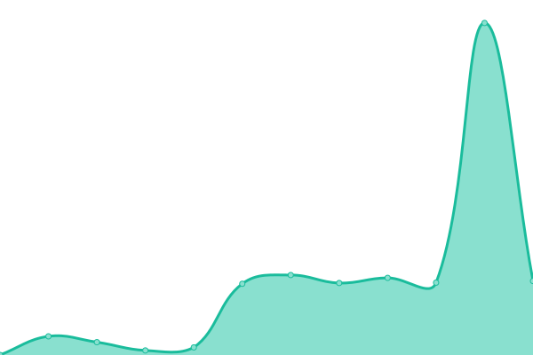 1824ms
     
 | 

<a href="https://CesarIvanSolis.github.io/Upptime/history/lineadirecta">99.67%</a>
    

|  [mejoraregulatoria](https://mejoraregulatoria.morelia.gob.mx/) | 🟩 Up | [mejoraregulatoria.yml](https://github.com/CesarIvanSolis/Upptime/commits/HEAD/history/mejoraregulatoria.yml) | 

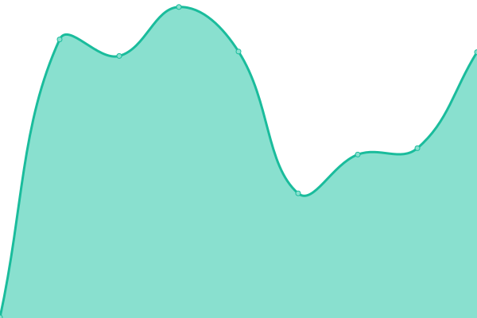 369ms
     
 | 

<a href="https://CesarIvanSolis.github.io/Upptime/history/mejoraregulatoria">100.00%</a>
    

|  [meritojuvenil](https://meritojuvenil.morelia.gob.mx/) | 🟩 Up | [meritojuvenil.yml](https://github.com/CesarIvanSolis/Upptime/commits/HEAD/history/meritojuvenil.yml) | 

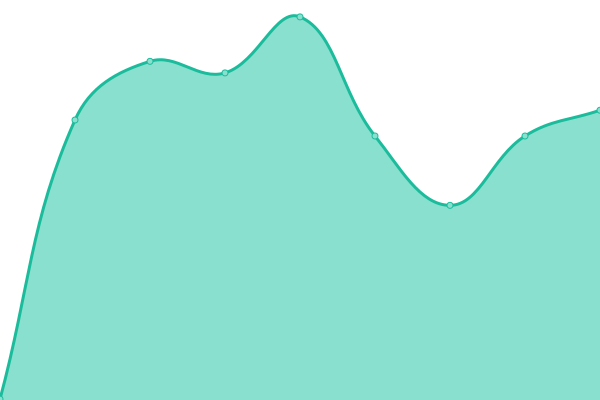 335ms
     
 | 

<a href="https://CesarIvanSolis.github.io/Upptime/history/meritojuvenil">100.00%</a>
    

|  [movil](https://movil.morelia.gob.mx/predial/login.php) | 🟩 Up | [movil.yml](https://github.com/CesarIvanSolis/Upptime/commits/HEAD/history/movil.yml) | 

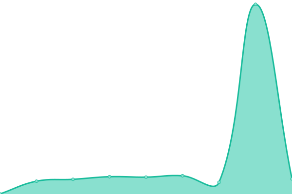 354ms
     
 | 

<a href="https://CesarIvanSolis.github.io/Upptime/history/movil">100.00%</a>
    

|  [oamap](https://oamap.morelia.gob.mx/) | 🟥 Down | [oamap.yml](https://github.com/CesarIvanSolis/Upptime/commits/HEAD/history/oamap.yml) | 

 0ms
     
 | 

<a href="https://CesarIvanSolis.github.io/Upptime/history/oamap">0.00%</a>
    

|  [obraspublicas](https://obraspublicas.morelia.gob.mx/admonpai/login.php) | 🟩 Up | [obraspublicas.yml](https://github.com/CesarIvanSolis/Upptime/commits/HEAD/history/obraspublicas.yml) | 

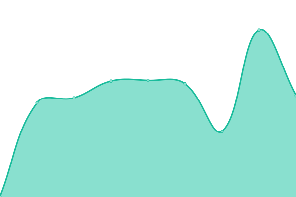 307ms
     
 | 

<a href="https://CesarIvanSolis.github.io/Upptime/history/obraspublicas">100.00%</a>
    

|  [obraspublicas contratistas](https://obraspublicas.morelia.gob.mx/contratistas) | 🟩 Up | [obraspublicas-contratistas.yml](https://github.com/CesarIvanSolis/Upptime/commits/HEAD/history/obraspublicas-contratistas.yml) | 

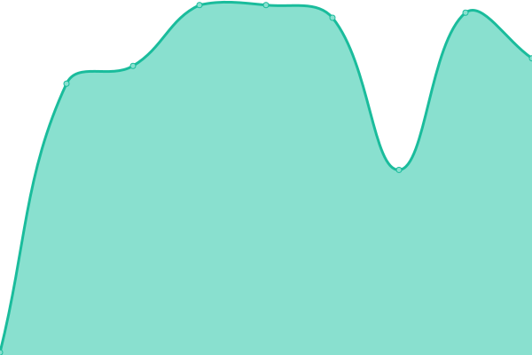 117ms
     
 | 

<a href="https://CesarIvanSolis.github.io/Upptime/history/obraspublicas-contratistas">100.00%</a>
    

|  [obrasyacciones](https://obrasyacciones.morelia.gob.mx/) | 🟩 Up | [obrasyacciones.yml](https://github.com/CesarIvanSolis/Upptime/commits/HEAD/history/obrasyacciones.yml) | 

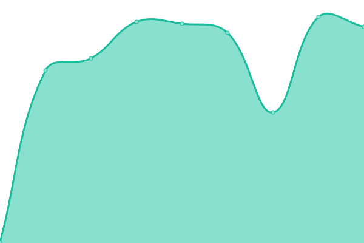 312ms
     
 | 

<a href="https://CesarIvanSolis.github.io/Upptime/history/obrasyacciones">100.00%</a>
    

|  [pagostramites](https://pagostramites.morelia.gob.mx/login.php) | 🟥 Down | [pagostramites.yml](https://github.com/CesarIvanSolis/Upptime/commits/HEAD/history/pagostramites.yml) | 

 0ms
     
 | 

<a href="https://CesarIvanSolis.github.io/Upptime/history/pagostramites">0.00%</a>
    

|  [reportes2](https://reportes2.morelia.gob.mx/dotask.aspx) | 🟩 Up | [reportes2.yml](https://github.com/CesarIvanSolis/Upptime/commits/HEAD/history/reportes2.yml) | 

 309ms
     
 | 

<a href="https://CesarIvanSolis.github.io/Upptime/history/reportes2">100.00%</a>
    

|  [scu ctrlusuarios](https://scu.morelia.gob.mx/CtrlUsuarios/loginGral?token=&sistema=13&au=http://sisop.morelia.gob.mx) | 🟩 Up | [scu-ctrlusuarios.yml](https://github.com/CesarIvanSolis/Upptime/commits/HEAD/history/scu-ctrlusuarios.yml) | 

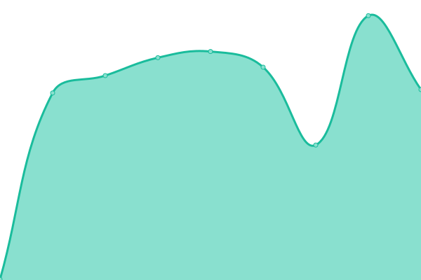 354ms
     
 | 

<a href="https://CesarIvanSolis.github.io/Upptime/history/scu-ctrlusuarios">100.00%</a>
    

|  [serviciosmorelos repors](https://serviciosmorelos.morelia.gob.mx/Reports/) | 🟩 Up | [serviciosmorelos-repors.yml](https://github.com/CesarIvanSolis/Upptime/commits/HEAD/history/serviciosmorelos-repors.yml) | 

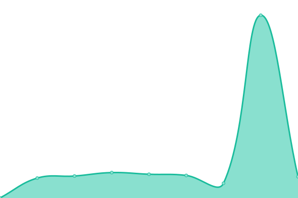 540ms
     
 | 

<a href="https://CesarIvanSolis.github.io/Upptime/history/serviciosmorelos-repors">100.00%</a>
    

|  [serviciosmorelos reports](https://serviciosmorelos.morelia.gob.mx/reports/do.php) | 🟩 Up | [serviciosmorelos-reports.yml](https://github.com/CesarIvanSolis/Upptime/commits/HEAD/history/serviciosmorelos-reports.yml) | 

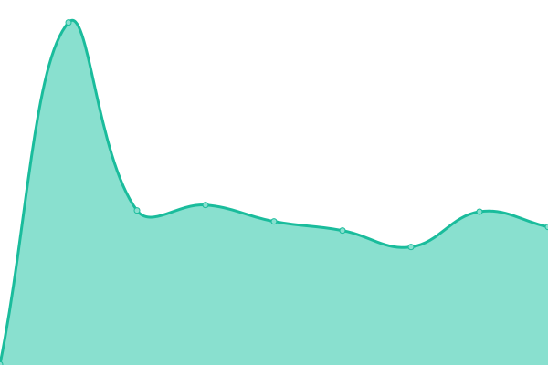 289ms
     
 | 

<a href="https://CesarIvanSolis.github.io/Upptime/history/serviciosmorelos-reports">100.00%</a>
    

|  [transito](https://transito.morelia.gob.mx/) | 🟩 Up | [transito.yml](https://github.com/CesarIvanSolis/Upptime/commits/HEAD/history/transito.yml) | 

 361ms
     
 | 

<a href="https://CesarIvanSolis.github.io/Upptime/history/transito">100.00%</a>
    

|  [transitoh](https://transitoh.morelia.gob.mx/) | 🟩 Up | [transitoh.yml](https://github.com/CesarIvanSolis/Upptime/commits/HEAD/history/transitoh.yml) | 

 406ms
     
 | 

<a href="https://CesarIvanSolis.github.io/Upptime/history/transitoh">100.00%</a>
    

|  [transparenciaproactiva](https://transparenciaproactiva.morelia.gob.mx/) | 🟩 Up | [transparenciaproactiva.yml](https://github.com/CesarIvanSolis/Upptime/commits/HEAD/history/transparenciaproactiva.yml) | 

 1053ms
     
 | 

<a href="https://CesarIvanSolis.github.io/Upptime/history/transparenciaproactiva">100.00%</a>
    

|  [wsfacturav33](https://wsfacturav33.morelia.gob.mx/generaTimbrado.aspx) | 🟥 Down | [wsfacturav33.yml](https://github.com/CesarIvanSolis/Upptime/commits/HEAD/history/wsfacturav33.yml) | 

 0ms
     
 | 

<a href="https://CesarIvanSolis.github.io/Upptime/history/wsfacturav33">0.00%</a>
    

|  [morelia](https://www.morelia.gob.mx/) | 🟩 Up | [morelia.yml](https://github.com/CesarIvanSolis/Upptime/commits/HEAD/history/morelia.yml) | 

 466ms
     
 | 

<a href="https://CesarIvanSolis.github.io/Upptime/history/morelia">100.00%</a>
    

|  [policiamorelia](https://www.policiamorelia.gob.mx/) | 🟩 Up | [policiamorelia.yml](https://github.com/CesarIvanSolis/Upptime/commits/HEAD/history/policiamorelia.yml) | 

 430ms
     
 | 

<a href="https://CesarIvanSolis.github.io/Upptime/history/policiamorelia">100.00%</a>
    

<!--end: status pages-->

[**Visit our status website →**](https://CesarIvanSolis.github.io/Upptime)

## 📄 License

- Powered by: [Upptime](https://github.com/upptime/upptime)
- Code: [MIT](./LICENSE) © [CesarIvanSolis](https://CesarIvanSolis.github.io/Upptime)
- Data in the `./history` directory: [Open Database License](https://opendatacommons.org/licenses/odbl/1-0/)
